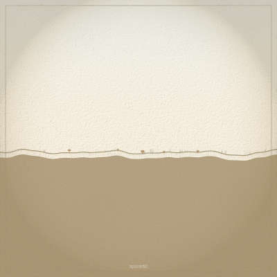
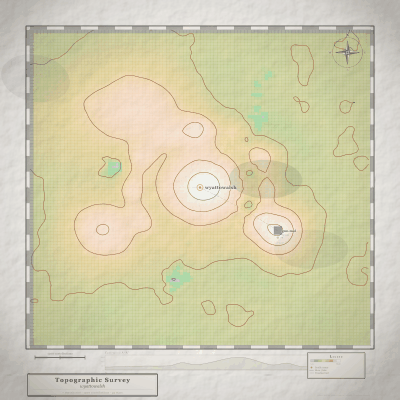
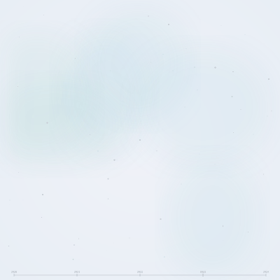
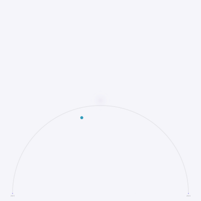
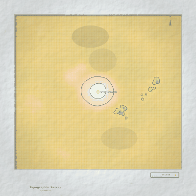

<p align="center">
  <picture>
    <source media="(prefers-color-scheme: dark)" srcset=".github/assets/img/banner.svg">
    
  </picture>
</p>

<!-- README:TOP_BADGES:START -->
<p align="center"><a href="https://w4w.dev" target="_blank"></a>
<a href="https://linkedin.com/in/wyattowalsh" target="_blank"></a>
<a href="https://www.kaggle.com/wyattowalsh" target="_blank"></a>
<a href="https://x.com/wyattowalsh" target="_blank"></a></p>
<!-- README:TOP_BADGES:END -->

## Featured Projects

<!-- README:FEATURED_PROJECTS:START -->
<table><tbody>
<tr>
<td valign="top" width="50%"><a href="https://github.com/wyattowalsh/agents" target="_blank"></a></td>
<td valign="top" width="50%"><a href="https://github.com/wyattowalsh/nbadb" target="_blank"></a></td>
</tr>
<tr>
<td valign="top" width="50%"><a href="https://github.com/wyattowalsh/proxywhirl" target="_blank"></a></td>
<td valign="top" width="50%"><a href="https://github.com/wyattowalsh/mcp-crawl4ai" target="_blank"></a></td>
</tr>
<tr>
<td valign="top" width="50%"><a href="https://github.com/wyattowalsh/fl-mcp" target="_blank"></a></td>
<td valign="top" width="50%"><a href="https://github.com/wyattowalsh/listentropy" target="_blank"></a></td>
</tr>
<tr>
<td valign="top" width="50%"><a href="https://github.com/wyattowalsh/personal-website" target="_blank"></a></td>
<td valign="top" width="50%"><a href="https://github.com/wyattowalsh/mdxpad" target="_blank"></a></td>
</tr>
<tr>
<td valign="top" width="50%"><a href="https://github.com/wyattowalsh/ai-web-feeds" target="_blank"></a></td>
<td width="50%"></td>
</tr>
</tbody></table>
<!-- README:FEATURED_PROJECTS:END -->


## Living Art

> Living artwork driven by this profile's GitHub data — watch it grow from bare soil to full bloom over 30 seconds.

<table role="presentation">
<tr>
<td width="50%" align="center">
  <a href=".github/assets/img/inkgarden-growth-animated.svg">
    
  </a>
  <br/>
  <sub><b>Ink Garden</b> — each tree is a repository, blooms appear as stars accumulate (<code>inkgarden-growth.gif</code>, timeline SVG: <code>inkgarden-growth-animated.svg</code>)</sub>
</td>
<td width="50%" align="center">
  <a href=".github/assets/img/topo-growth-animated.svg">
    
  </a>
  <br/>
  <sub><b>Topography</b> — terrain contours, rivers, and cartographic chrome emerge with activity (<code>topo-growth.gif</code>, timeline SVG: <code>topo-growth-animated.svg</code>)</sub>
</td>
</tr>
<tr>
<td width="50%" align="center">
  <a href=".github/assets/img/animated-community.svg">
    <picture>
      <source media="(prefers-color-scheme: dark)" srcset=".github/assets/img/animated-community-dark.gif">
      
    </picture>
  </a>
  <br/>
  <sub><b>Cosmic Genesis</b> — Clifford attractor density field revealed progressively as stars and forks accumulate (<code>animated-community.gif</code>, source SVG: <code>animated-community.svg</code>)</sub>
</td>
<td width="50%" align="center">
  <a href=".github/assets/img/animated-activity.svg">
    <picture>
      <source media="(prefers-color-scheme: dark)" srcset=".github/assets/img/animated-activity-dark.gif">
      
    </picture>
  </a>
  <br/>
  <sub><b>Unfurling Spiral</b> — phyllotaxis spiral grows from a single seed as contributions build (<code>animated-activity.gif</code>, source SVG: <code>animated-activity.svg</code>)</sub>
</td>
</tr>
</table>

> [!NOTE] Compatibility phase: all four living-art panels now embed stable GIFs for GitHub-safe inline playback and link through to their richer SVG sources. Regenerate via `uv run readme generate living-art` and `uv run readme generate animated`. Timelapse GIFs (daily history evolution) via `uv run readme generate timelapse`. See footnote[^1].

<details>
<summary><strong>Timelapse GIFs — day-by-day evolution (click to expand)</strong></summary>

Each timelapse GIF shows your profile's artwork evolving frame by frame, where **each frame = one real calendar day** from account creation to yesterday. Weather, season, time-of-day, and energy levels all change based on your real GitHub data.

<table role="presentation">
<tr>
<td width="50%" align="center">
  
  <br/>
  <sub><b>Ink Garden</b> timelapse — watch the botanical garden grow day by day</sub>
</td>
<td width="50%" align="center">
  
  <br/>
  <sub><b>Topography</b> timelapse — terrain emerges and evolves day by day</sub>
</td>
</tr>
<tr>
<td width="50%" align="center">
  
  <br/>
  <sub><b>Cosmic Genesis</b> timelapse — the cosmic field builds as stars and forks accumulate</sub>
</td>
<td width="50%" align="center">
  
  <br/>
  <sub><b>Unfurling Spiral</b> timelapse — the spiral unfurls as contributions build</sub>
</td>
</tr>
</table>

Generate: `uv run readme generate timelapse --metrics-path metrics.json --history-path history.json --profile YOUR_USERNAME`

</details>

<!-- BEGIN MANAGED MARKER -->
<details>
<summary><strong>Living Art data mapping (click to expand)</strong></summary>

- **Ink Garden** (living-art)
  - Visual (compat): `inkgarden-growth.gif`
  - Visual (timeline): `inkgarden-growth-animated.svg`
  - Data inputs: `repos[]` (`name`, `language`, `stars`, `age_months`)
  - Mapping: Each repo → one plant; language sets hue/species; age → plant size/branch depth; stars → bloom size/petal counts; repo names → botanical labels.
  - Ecosystem details: `forks`, `watchers`, `contributions_last_year`, `orgs_count`, `network_count`, `open_issues_count`, `following`, `contributions_monthly`, `stars`
    - Mapping notes: forks → root networks; watchers/contributions/orgs/stars add insects/seeds; network → webs; open issues → mushrooms; following → tendrils; monthly contributions → stipple density.
- **Topography** (living-art)
  - Visual (compat): `topo-growth.gif`
  - Visual (timeline): `topo-growth-animated.svg`
  - Data inputs: `repos[]` (`stars`, `age_months`, `language`, `name`)
  - Mapping: Repos → hills/landmarks; stars → peak height & marker size; age → hill width & age markers; language → terrain texture & color; names/stars → map labels.
  - Terrain/chrome: `total_commits`, `contributions_monthly`, `forks`, `followers`, `contributions_last_year`, `stars`
    - Mapping: commits → base noise detail; monthly contributions → ridge intensity + month label opacity; forks → river count; followers → contour density; contributions/stars → survey/title annotations.
- **Cosmic Genesis** (animated — community)
  - Visual (compat): `animated-community.gif` / `animated-community-dark.gif`
  - Visual (source): `animated-community.svg` / `animated-community-dark.svg`
  - Data inputs: commit history timeline with `stars`, `forks`, `languages`, milestone events
  - Mapping: Clifford attractor density field; stars/forks → progressive reveal density; language → OKLCH hue; calendar milestones → ring-burst animations; contribution particles → emission rate.
- **Unfurling Spiral** (animated — activity)
  - Visual (compat): `animated-activity.gif` / `animated-activity-dark.gif`
  - Visual (source): `animated-activity.svg` / `animated-activity-dark.svg`
  - Data inputs: `public_repos`, `followers`, `orgs_count`, `contributions_last_year`, `total_commits`, `following`, `languages`
  - Mapping: Phyllotaxis spiral; repos/followers → octave complexity; contributions → dot count & temporal easing; languages → palette colors; flow-field lines draw as activity builds.
- Growth timing (all four): `compute_maturity(metrics)` drives maturity and timeline staging over ~30s; maturity computed from commits, stars, contributions, followers, repo_count/age, forks, network_size.

</details>
<!-- END MANAGED MARKER -->

[^1]: Living-art outputs are dual-written during migration: GIF embeds remain for GitHub-safe inline playback, while richer SVG sources stay available behind the linked images.

> Note: the header banner (`banner.svg`) is config-driven (`config.yaml`), not mapped to GitHub activity metrics.

## Tech Stack

<p>
  
  
  
  
  
  
  
</p>

<details>
<summary><strong>View full stack (200+ technologies)</strong></summary>

<!-- SKILLS:START -->
### Programming Languages

<p>
  
  
  
  
  
  
  
  
  
  
  
  
  
  
  
</p>

### AI & LLMs

<p>
  
  
  
  
  
  
  
  
</p>

### Data

#### Collection

<p>
  
  
  
  
  
</p>

#### Storage

<p>
  
  
  
  
  
  
  
</p>

#### Visualization

<p>
  
  
  
  
</p>

#### Processing

<p>
  
  
  
  
  
  
  
  
  
</p>

#### Modeling

<p>
  
  
  
  
  
  
  
  
</p>

#### Deployment

<p>
  
  
  
  
  
  
</p>

### Cloud Technologies

<p>
  
  
  
  
  
</p>

### CI/CD Platforms

<p>
  
  
</p>

### Version Control Platforms

<p>
  
  
  
</p>

### Workflow Tools

<p>
  
  
  
  
  
  
  
  
  
  
  
  
  
  
  
  
  
  
  
  
  
  
</p>

### Optimization Tools

<p>
  
  
  
  
  
  
</p>

### Web Development

<p>
  
  
  
  
  
  
  
  
  
  
  
  
  
  
  
  
  
  
  
  
  
  
  
  
  
  
  
</p>

### Miscellaneous

<p>
  
  
  
  
  
  
  
  
  
  
  
  
  
  
  
  
  
  
  
  
  
  
  
  
  
  
  
  
  
  
  
  
</p>
<!-- SKILLS:END -->

</details>

## Metrics

<table><tbody>
<tr>
<td valign="top" width="50%"></td>
<td valign="top" width="50%"></td>
</tr>
</tbody></table>

## Word Clouds

<p align="center">
  
  
</p>

<sub>Data source mapping: in Markdown-source mode (<code>--from-topics-md</code> / <code>--from-languages-md</code>), these clouds are generated from <code>.github/assets/topics.md</code> and <code>.github/assets/languages.md</code>, with term size based on parsed Markdown frequencies.</sub>

<details>
<summary><strong>WakaTime Stats</strong></summary>

<!--START_SECTION:waka-->


**🐱 My GitHub Data**

> 📦 4.9 MB Used in GitHub's Storage
 >
> 💼 Opted to Hire
 >
> 📜 94 Public Repositories
 >
> 🔑 73 Private Repositories
 >
**I'm a Night 🦉**

```text
🌞 Morning                611 commits         ███░░░░░░░░░░░░░░░░░░░░░░   11.30 %
🌆 Daytime                970 commits         ████░░░░░░░░░░░░░░░░░░░░░   17.94 %
🌃 Evening                2214 commits        ██████████░░░░░░░░░░░░░░░   40.95 %
🌙 Night                  1611 commits        ███████░░░░░░░░░░░░░░░░░░   29.80 %
```
📅 **I'm Most Productive on Tuesday**

```text
Monday                   515 commits         ██░░░░░░░░░░░░░░░░░░░░░░░   09.53 %
Tuesday                  1303 commits        ██████░░░░░░░░░░░░░░░░░░░   24.10 %
Wednesday                744 commits         ███░░░░░░░░░░░░░░░░░░░░░░   13.76 %
Thursday                 897 commits         ████░░░░░░░░░░░░░░░░░░░░░   16.59 %
Friday                   585 commits         ███░░░░░░░░░░░░░░░░░░░░░░   10.82 %
Saturday                 440 commits         ██░░░░░░░░░░░░░░░░░░░░░░░   08.14 %
Sunday                   922 commits         ████░░░░░░░░░░░░░░░░░░░░░   17.06 %
```


📊 **This Week I Spent My Time On**

```text
💬 Programming Languages:
Other                    20 hrs 52 mins      ██████████████░░░░░░░░░░░   57.73 %
JSON                     7 hrs 9 mins        █████░░░░░░░░░░░░░░░░░░░░   19.81 %
sh                       2 hrs 21 mins       ██░░░░░░░░░░░░░░░░░░░░░░░   06.51 %
TypeScript               2 hrs 16 mins       ██░░░░░░░░░░░░░░░░░░░░░░░   06.30 %
Git Config               1 hr 6 mins         █░░░░░░░░░░░░░░░░░░░░░░░░   03.07 %

💻 Operating System:
Mac                      36 hrs 10 mins      █████████████████████████   100.00 %
```

**I Mostly Code in Jupyter Notebook**

```text
Python                   11 repos            █████░░░░░░░░░░░░░░░░░░░░   20.37 %
TypeScript               11 repos            █████░░░░░░░░░░░░░░░░░░░░   20.37 %
Handlebars               1 repo              ░░░░░░░░░░░░░░░░░░░░░░░░░   01.85 %
Rust                     1 repo              ░░░░░░░░░░░░░░░░░░░░░░░░░   01.85 %
MDX                      1 repo              ░░░░░░░░░░░░░░░░░░░░░░░░░   01.85 %
```


**Timeline**


 Last Updated on 27/04/2025 18:43:21 UTC
<!--END_SECTION:waka-->

</details>

<details>
<summary><strong>Latest Blog Posts</strong></summary>

<!-- README:BLOG_POSTS:START -->
<p align="center"><a href="https://w4w.dev/blog/posts/proxywhirl" target="_blank"></a>
<a href="https://w4w.dev/blog/posts/w4w-v6" target="_blank"></a>
<a href="https://w4w.dev/blog/posts/regularized-linear-regression-models-pt3" target="_blank"></a>
<a href="https://w4w.dev/blog/posts/regularized-linear-regression-models-pt2" target="_blank"></a>
<a href="https://w4w.dev/blog/posts/regularized-linear-regression-models-pt1" target="_blank"></a></p>
<p align="center"><sub>📡 Auto-updated from <a href="https://w4w.dev/feed.xml">RSS feed</a></sub></p>
<!-- README:BLOG_POSTS:END -->

</details>

<p align="center">
  
  
  
</p>

---

<p align="center">
  
  <a href="https://github.com/wyattowalsh/wyattowalsh/actions/workflows/profile-updater.yml">
    
  </a>
</p>

