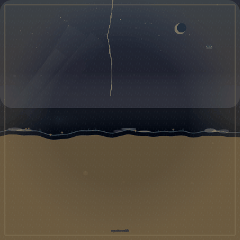
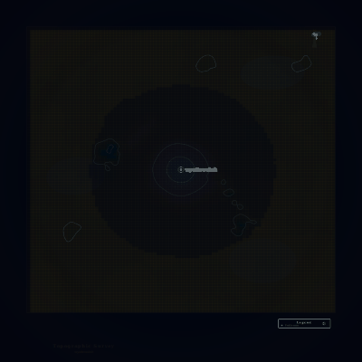
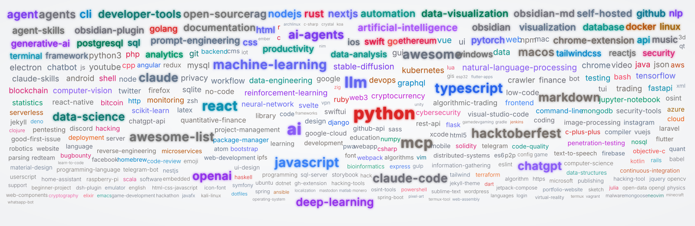
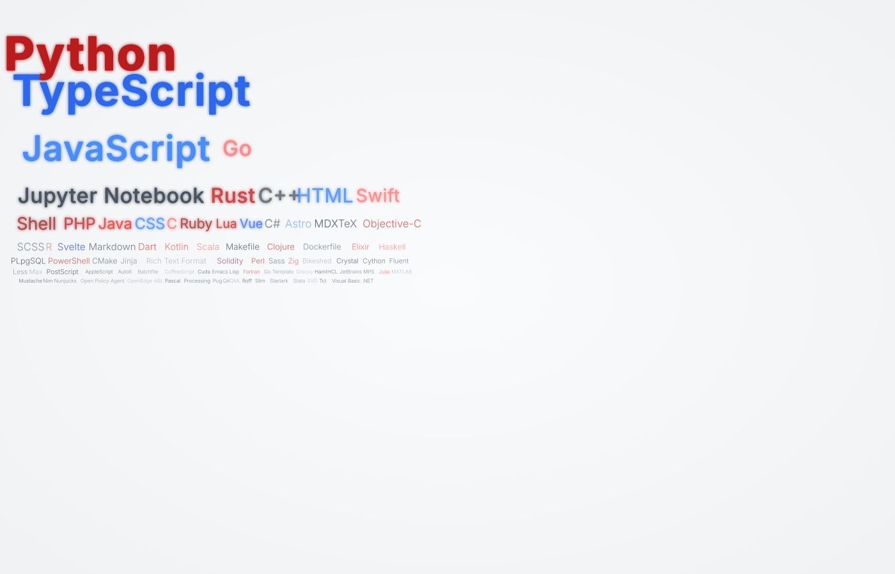
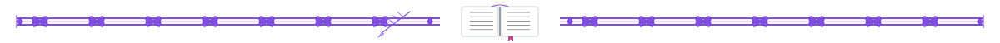
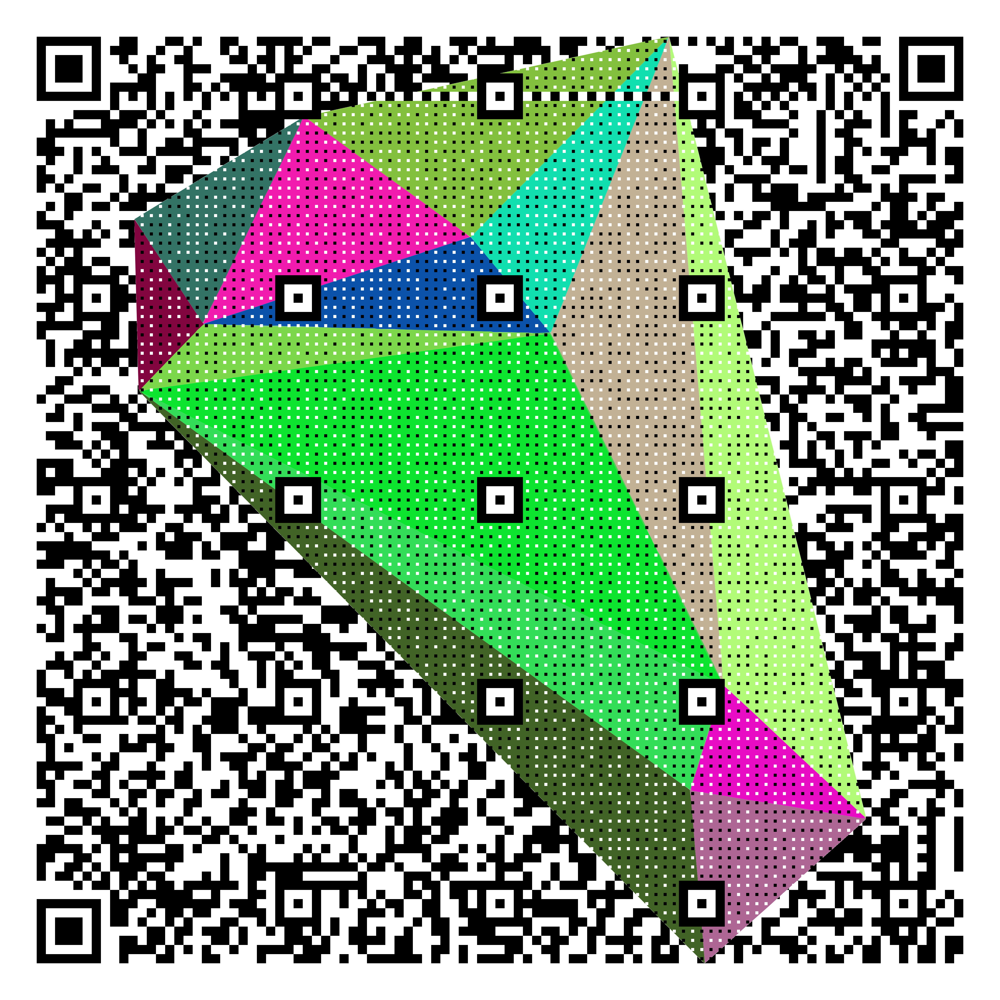

  <picture>
    <source media="(prefers-color-scheme: dark)" srcset=".github/assets/img/banner-dark.svg">
    
  </picture>

<!-- README:TOP_BADGES:START -->

<a href="https://w4w.dev" target="_blank" rel="noopener noreferrer"></a>

<a href="https://www.kaggle.com/wyattowalsh" target="_blank" rel="noopener noreferrer"></a>

<!-- README:TOP_BADGES:END -->

<!-- ## Featured Projects -->

<!-- README:FEATURED_PROJECTS:START -->

<a href="https://github.com/wyattowalsh/agents" target="_blank" rel="noopener noreferrer"></a>
<a href="https://github.com/wyattowalsh/nbadb" target="_blank" rel="noopener noreferrer"></a>
<a href="https://github.com/wyattowalsh/proxywhirl" target="_blank" rel="noopener noreferrer"></a>
<a href="https://github.com/wyattowalsh/mcp-crawl4ai" target="_blank" rel="noopener noreferrer"></a>
<a href="https://github.com/wyattowalsh/fl-mcp" target="_blank" rel="noopener noreferrer"></a>
<a href="https://github.com/wyattowalsh/personal-website" target="_blank" rel="noopener noreferrer"></a>
<a href="https://github.com/wyattowalsh/ai-web-feeds" target="_blank" rel="noopener noreferrer"></a>

<!-- README:FEATURED_PROJECTS:END -->

<!-- ## Metrics -->

<table><tr>
<td width="50%" valign="top"></td>
<td width="50%" valign="top"></td>
</tr></table>





<!--START_SECTION:waka-->
<!-- WakaTime SVG is rendered from .github/assets/img/wakatime.svg -->
<!--END_SECTION:waka-->

<!-- ## Living Art -->

<a href=".github/assets/img/living-inkgarden.mp4"></a>
<a href=".github/assets/img/living-topo.mp4"></a>

<!-- ## My Tech Stack -->

<strong>My Tech Stack</strong>

<!-- SKILLS:START -->
### Programming Languages

  
  
  
  
  
  
  
  
  
  
  
  
  
  
  

### AI & LLMs

  
  
  
  
  
  
  
  

### Data

#### Collection

  
  
  
  
  

#### Storage

  
  
  
  
  
  
  

#### Visualization

  
  
  
  

#### Processing

  
  
  
  
  
  
  
  
  
  
  

#### Modeling

  
  
  
  
  
  
  
  
  

#### Deployment

  
  

### Cloud Technologies

  
  
  
  
  

### CI/CD Platforms

  
  

### Version Control Platforms

  
  
  

### Workflow Tools

  
  
  
  
  
  
  
  
  
  
  
  
  
  
  
  
  
  
  

### Optimization Tools

  
  
  
  
  
  

### Web Development

  
  
  
  
  
  
  
  
  
  
  
  
  
  
  
  
  
  
  
  
  
  
  
  
  
  
  
  

### Miscellaneous

  
  
  
  
  
  
  
  
  
  
  
  
  
  
  
  
  
  
  
  
  
  
  
  
  
  
  

<!-- SKILLS:END -->

<!-- ## Word Clouds -->







<!-- ## Latest Blog Posts -->

<!-- README:BLOG_POSTS:START -->

<a href="https://www.w4w.dev/blog/posts/personal-website" target="_blank" rel="noopener noreferrer"></a>

<a href="https://www.w4w.dev/blog/posts/regularized-linear-regression-models-pt3" target="_blank" rel="noopener noreferrer"></a>
<a href="https://www.w4w.dev/blog/posts/regularized-linear-regression-models-pt2" target="_blank" rel="noopener noreferrer"></a>

Auto-updated from <a href="https://w4w.dev/feed.xml">RSS feed</a>

<!-- README:BLOG_POSTS:END -->

  

---

  
  
  

