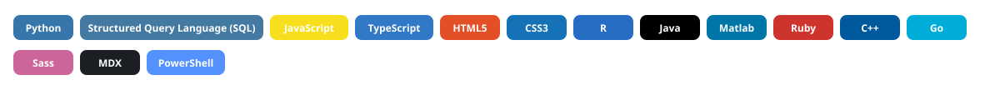
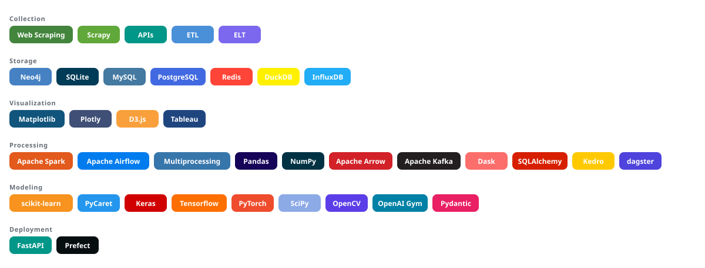
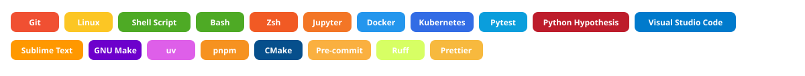
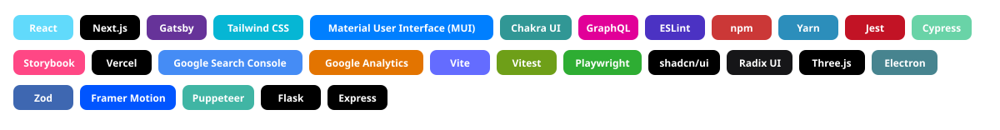
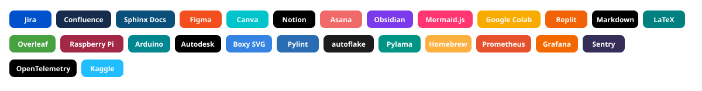

  <picture>
    <source media="(prefers-color-scheme: dark)" srcset=".github/assets/img/banner-dark.svg">
    
  </picture>

<!-- README:TOP_BADGES:START -->

<!-- README:TOP_BADGES:END -->

## Featured Projects

<!-- README:FEATURED_PROJECTS:START -->

<!-- README:FEATURED_PROJECTS:END -->

## Metrics

<!--START_SECTION:waka-->
<!-- WakaTime SVG is rendered from .github/assets/img/wakatime.svg -->
<!--END_SECTION:waka-->

## Living Art

Each GIF is a cumulative daily timelapse: frame *t* is rendered from the GitHub state available through day *t*, so repositories, stars, releases, and contribution history accrete over time.

## Tech Stack

<strong>Tech Stack</strong>

<!-- SKILLS:START -->
### Programming Languages

### AI & LLMs

### Data

#### Collection

#### Storage

#### Visualization

#### Processing

#### Modeling

#### Deployment

### Cloud Technologies

### CI/CD Platforms

### Version Control Platforms

### Workflow Tools

### Optimization Tools

### Web Development

### Miscellaneous

<!-- SKILLS:END -->

## Word Clouds

Topic and language clouds generated from the full parsed source lists; every term is preserved in a stable typographic layout sized by frequency.

## Latest Blog Posts

<!-- README:BLOG_POSTS:START -->

<a href="https://www.w4w.dev/blog/posts/personal-website" target="_blank" rel="noopener noreferrer">Personal Website — 2026-04-26</a> · <a href="https://www.w4w.dev/blog/posts/agents" target="_blank" rel="noopener noreferrer">Agents — 2026-04-26</a> · <a href="https://www.w4w.dev/blog/posts/proxywhirl" target="_blank" rel="noopener noreferrer">ProxyWhirl — 2026-02-13</a> · <a href="https://www.w4w.dev/blog/posts/regularized-linear-regression-models-pt3" target="_blank" rel="noopener noreferrer">Implementing Pathwise Coordinate Descent For The Lasso and The Elastic Net In Python Using NumPy — 2021-01-15</a> · <a href="https://www.w4w.dev/blog/posts/regularized-linear-regression-models-pt2" target="_blank" rel="noopener noreferrer">Using Ridge Regression to Overcome Drawbacks of Ordinary Least Squares (OLS) — 2021-01-14</a>

Auto-updated from <a href="https://w4w.dev/feed.xml">RSS feed</a>

<!-- README:BLOG_POSTS:END -->

  

---

  
  

