<div align="center">
    
</div>

---

Here, you can find:

- Links to some of my other various online profiles (sidebar)

- [Some of my public software projects](#projects) (both archived and current)

- [Technologies and workflows I've encountered](#technologies-and-workflows)

- [Some stats on my tech utilization](#stats)

> &nbsp;
> 
> It's awesome generating meaningful, positive impact while collaborating with passionate, curious people.
> 
> Feel free to reach out to me wherever and I look forward to seeing what we can create! 👨‍🍳 🏗️ 📈
>
>
> **Thanks for stopping by!** 👋
> &nbsp;

---

## Projects 📝 📊 

<p align='center'>
    <a href="https://github.com/wyattowalsh/personal-website"></a>
    <a href="https://github.com/wyattowalsh/nba-db"></a>
    <a href="https://github.com/wyattowalsh/macaron"></a>
    <a href="https://github.com/wyattowalsh/rigready"></a>
</p>

<h4 align='center'> ↓ Please see <a href="#past-projects">the pinned repositories</a> at the bottom of the page for my past projects ↓ </h4>

---

# Technologies

## Core Development
### Programming & Scripting
#### General Purpose Languages
- Python
- JavaScript
- TypeScript
- Go (Golang)
- Ruby
- Java
- MATLAB
- R

#### Terminal & Shell Environments
- Bash
- Zsh
- Oh My Zsh
- Makefile
- Linux
- macOS
- Windows

### Development Environment
#### IDEs & Editors
- VSCode
- Cursor
- Visual Studio
- Xcode
- Sublime Text
- Replit
- Jupyter Suite
  - Notebook
  - Lab
  - Google Colab

#### Virtual Environments & Dependency Management
##### Python Utilities
- Poetry
- uv
- pip
- pyenv
- Anaconda
- PyPI

##### Node.js Package Management
- NPM
- Yarn
- pnpm
- NVM

##### Other Package Managers
- Homebrew
- RVM

### Version Control & Collaboration
#### Version Control Tools
- Git
- GitHub
- GitHub Actions

## Web Technologies
### Frontend Development
#### UI Frameworks
- React
  - React DevTools
  - React Query
  - React Server Components
  - Redux
  - MobX
- Next.js
- React Native
- Gatsby
- shadcn/ui

#### Markup & Styling
- HTML
- CSS
- SCSS
- JSON
- YAML
- Markdown
- LaTeX
- Tailwind CSS
  - Tailwind Typography Plugin
- Framer Motion
- Material UI
- Mantine UI
- Styled Components
- Emotion (CSS-in-JS)
- p5.js
- Bootstrap
- Storybook

### Backend Development
#### Frameworks & Servers
- FastAPI
- Flask
- GraphQL
- WebSockets API
- JWT Auth Middleware
- API Rate Limiting / Throttling Middleware
- Cookiecutter
- Swagger (OpenAPI)

#### API Development & Integration
- Tenacity
- Pydantic
  - Pydantic Settings
- Uvicorn
- Gunicorn
- Click / Typer
- asyncpg

## Data & Infrastructure
### Cloud Platforms & Infrastructure
#### Cloud Providers
- AWS
  - AWS S3
  - AWS Lambda
- Azure
  - Azure Functions
- GCP
  - Google Cloud Functions
  - BigQuery

#### Containerization & Orchestration
- Vercel
- Supabase
- Docker
  - Docker Compose
- Kubernetes
- Terraform
- Turbo

### Data & Analytics
#### Databases & Data Storage
- PostgreSQL
- MySQL
- SQLite
- Neo4j
- kdb
- Weaviate

#### Databases & ORMs
- SQLAlchemy
- SQLModel
- Alembic

#### Data Science & Machine Learning
##### Machine Learning Frameworks
- PyTorch
- TensorFlow / Keras
- scikit-learn
- XGBoost
- PyCaret
- MLflow
- Transformers (Hugging Face)
- Reinforcement Learning
- LangChain
- LlamaIndex
- LangGraph
- Flowise
- LangFlow
- Claude (Anthropic)
- OpenAI API / ChatGPT
- Prompt Engineering

##### Core Libraries
- NumPy
- pandas
- SciPy
- Dask
- PySpark
- Apache Arrow
- Statsmodels
- Prophet
- Neural Prophet
- Ray
- NetworkX

#### Data Visualization & Dashboards
- Matplotlib
- Seaborn
- Plotly / Dash
- D3.js
- Grafana
- Tableau
- Bokeh
- ipywidgets

## Tools & Utilities
### Testing & Debugging
#### Testing Frameworks
- Hypothesis
- Pytest
- Cypress
- Jest

### Documentation & Knowledge
- Sphinx
- Docusaurus
- Mermaid
- Read the Docs
- LaTeX
- RSS

### Crawling & Scraping
- Scrapy
- Crawlee
- Requests
- Proxies
- Spotipy (Spotify)
- PRAW (Python Reddit API Wrapper)
- Stripe
- Selenium

## Professional Tools
### Project & Team Tools
#### Project Management & Collaboration
- Jira
- Confluence
- Asana
- Monday

#### Productivity & Office Tools
- Notion
- Obsidian
- Microsoft Excel
- Microsoft Office
- Overleaf

#### UI/UX & Design Tools
- Figma
- Boxy SVG
- Canva
- CAD
  - Autodesk
  - SolidWorks

### Specialized Domains
#### Data Engineering & Pipelines
- Kedro
- Airflow
- MultiProcessing
- joblib
- ETL / ELT

#### Optimization & Operations Research
- Gurobi
- PuLP
- IBM CPLEX
- Optimization Metaheuristics

## Stats 📊 📈

<details>
<summary>Click here to expand ↩️</summary>
<br>

### My Wakatime Stats 👨‍💻 🗓️


**🐱 My GitHub Data** 

> 📦 4.8 MB Used in GitHub's Storage 
 > 
> 💼 Opted to Hire
 > 
> 📜 68 Public Repositories 
 > 
> 🔑 60 Private Repositories 
 > 
**I'm a Night 🦉** 

```text
🌞 Morning                562 commits         ███░░░░░░░░░░░░░░░░░░░░░░   10.95 % 
🌆 Daytime                908 commits         ████░░░░░░░░░░░░░░░░░░░░░   17.69 % 
🌃 Evening                2169 commits        ███████████░░░░░░░░░░░░░░   42.25 % 
🌙 Night                  1495 commits        ███████░░░░░░░░░░░░░░░░░░   29.12 % 
```
📅 **I'm Most Productive on Tuesday** 

```text
Monday                   500 commits         ██░░░░░░░░░░░░░░░░░░░░░░░   09.74 % 
Tuesday                  1263 commits        ██████░░░░░░░░░░░░░░░░░░░   24.60 % 
Wednesday                729 commits         ████░░░░░░░░░░░░░░░░░░░░░   14.20 % 
Thursday                 841 commits         ████░░░░░░░░░░░░░░░░░░░░░   16.38 % 
Friday                   572 commits         ███░░░░░░░░░░░░░░░░░░░░░░   11.14 % 
Saturday                 402 commits         ██░░░░░░░░░░░░░░░░░░░░░░░   07.83 % 
Sunday                   827 commits         ████░░░░░░░░░░░░░░░░░░░░░   16.11 % 
```

📊 **This Week I Spent My Time On** 

```text
💬 Programming Languages: 
sh                       11 hrs 55 mins      ████████░░░░░░░░░░░░░░░░░   30.91 % 
Python                   11 hrs 6 mins       ███████░░░░░░░░░░░░░░░░░░   28.80 % 
TypeScript               8 hrs 24 mins       █████░░░░░░░░░░░░░░░░░░░░   21.80 % 
Other                    3 hrs 42 mins       ██░░░░░░░░░░░░░░░░░░░░░░░   09.61 % 
Bash                     53 mins             █░░░░░░░░░░░░░░░░░░░░░░░░   02.31 % 

💻 Operating System: 
Mac                      38 hrs 33 mins      █████████████████████████   100.00 % 
```

**I Mostly Code in Jupyter Notebook** 

```text
Jupyter Notebook         13 repos            ████████░░░░░░░░░░░░░░░░░   30.95 % 
Python                   7 repos             ████░░░░░░░░░░░░░░░░░░░░░   16.67 % 
TypeScript               7 repos             ████░░░░░░░░░░░░░░░░░░░░░   16.67 % 
Makefile                 4 repos             ██░░░░░░░░░░░░░░░░░░░░░░░   09.52 % 
Shell                    1 repo              █░░░░░░░░░░░░░░░░░░░░░░░░   02.38 % 
```

**Timeline**


 Last Updated on 27/01/2025 18:42:43 UTC

</details>

---

<details>
<summary>Click here to expand additional stats ↩️</summary>
<br>

<div align='center'>
 
</div>

### My GitHub Stats :octocat: 📈 

|  |  |
| ------------------------- | ------------------------------------ |

</details>

---

## Connect With Me 🤝 📫

<div align="center">
  <a href="https://linkedin.com/in/wyattowalsh" target="_blank">
    
  </a>
  <a href="https://twitter.com/wyattowalsh" target="_blank">
    
  </a>
  <a href="https://github.com/wyattowalsh" target="_blank">
    
  </a>
  <a href="https://medium.com/@wyattowalsh" target="_blank">
    
  </a>
  <a href="https://dev.to/wyattowalsh" target="_blank">
    
  </a>
</div>

---

<div align="center">
  
</div>

<div align="center">
  <a href="https://github.com/wyattowalsh/wyattowalsh/actions/workflows/waka-readme.yml">
    
  </a>
  <a href="https://github.com/wyattowalsh/wyattowalsh/actions/workflows/metrics.yml">
    
  </a>
</div>

---

<div align="center">
  ⭐️ From <a href="https://github.com/wyattowalsh">wyattowalsh</a>
</div>

