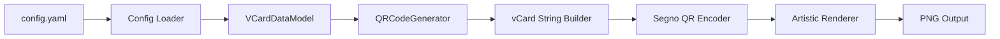

# QR Code Generation

The QR code generation module creates artistic vCard QR codes with custom styling and background images. This documentation covers the configuration, usage, and technical implementation details.

## Overview

The QR code generator (`scripts/qr.py`) creates vCard-formatted QR codes that contain contact information. When scanned, these QR codes allow users to quickly save contact details to their phone's contacts application. The generator supports:

- **vCard 3.0 format** with labeled URLs for better compatibility
- **Artistic rendering** with custom SVG backgrounds
- **High error correction** for reliable scanning
- **Configurable styling** and output settings

## Configuration

The QR code settings are configured in `config.yaml` under two main sections:

### vCard Data Configuration

```yaml
v_card_data:
  displayname: Wyatt Walsh
  n_givenname: Wyatt
  n_familyname: Walsh
  fn: Wyatt Walsh
  org: Personal Portfolio Project
  title: Developer & Tech Enthusiast
  tel_work_voice: '2096022545'
  email_internet: wyattowalsh@gmail.com
  url_work:
    - url: https://www.w4w.dev/
      label: Website
    - url: https://www.linkedin.com/in/wyattowalsh
      label: LinkedIn
    - url: https://www.github.com/wyattowalsh
      label: GitHub
```

### QR Code Settings

```yaml
qr_code_settings:
  output_filename: qr.png
  output_dir: .github/assets/img
  default_background_path: .github/assets/img/icon.svg
  default_scale: 25
  error_correction: H  # Options: L, M, Q, H
```

## Usage

### Command Line Interface

Generate QR code using the Makefile:

```bash
make generate-qr
```

Or using the CLI directly:

```bash
uv run readme generate qr_code
```

### Output

The generated QR code will be saved to:
- **Location**: `.github/assets/img/qr.png` (configurable)
- **Format**: PNG image with artistic SVG background
- **Resolution**: Scaled based on the `default_scale` setting

## Technical Details

### vCard Format

The generator creates vCard 3.0 formatted data with the following structure:

```
BEGIN:VCARD
VERSION:3.0
N:Walsh;Wyatt;;;
FN:Wyatt Walsh
DISPLAYNAME:Wyatt Walsh
ORG:Personal Portfolio Project
TITLE:Developer & Tech Enthusiast
EMAIL;TYPE=INTERNET,PREF:wyattowalsh@gmail.com
TEL;TYPE=WORK,VOICE:2096022545
item1.URL:https://www.w4w.dev/
item1.X-ABLabel:Website
item2.URL:https://www.linkedin.com/in/wyattowalsh
item2.X-ABLabel:LinkedIn
item3.URL:https://www.github.com/wyattowalsh
item3.X-ABLabel:GitHub
END:VCARD
```

### URL Labeling

URLs are labeled using the `itemX.URL` and `itemX.X-ABLabel` properties for better compatibility with contact applications, especially on Apple devices. This allows each URL to display with a descriptive label (e.g., "Website", "LinkedIn", "GitHub") instead of just showing the raw URL.

### Dependencies

The QR code generator requires:
- **Python packages**: `segno`, `CairoSVG` (specified in `pyproject.toml`)
- **System library**: Cairo graphics library (libcairo)

On macOS, install Cairo using Homebrew:
```bash
brew install cairo
```

### Error Correction Levels

The generator supports four error correction levels:
- **L**: ~7% error correction
- **M**: ~15% error correction  
- **Q**: ~25% error correction
- **H**: ~30% error correction (default, recommended)

## Architecture

### Core Components

1. **VCardDataModel** (`scripts/config.py`):
   - Pydantic model for vCard data validation
   - Supports typed URLs with labels
   - Ensures data consistency

2. **QRCodeGenerator** (`scripts/qr.py`):
   - Main class for QR code generation
   - Handles file paths and error checking
   - Manages artistic rendering with backgrounds

3. **Configuration Loading** (`scripts/config.py`):
   - Loads settings from `config.yaml`
   - Provides defaults if configuration is missing
   - Validates data types and formats

### Data Flow



## Troubleshooting

### Cairo Library Not Found

If you encounter errors about missing Cairo library:

```
Error: no library called "cairo-2" was found
```

**Solution**: Install Cairo and set the library path
```bash
# Install Cairo
brew install cairo

# Run with library path set (if needed)
export DYLD_LIBRARY_PATH=$(brew --prefix cairo)/lib:$DYLD_LIBRARY_PATH
```

The Makefile already includes this fix for the `generate-qr` target.

### QR Code Not Scanning

If the generated QR code doesn't scan properly:

1. **Check vCard format**: Ensure proper line endings (`\n` not `\\n`)
2. **Verify data**: Check for special characters or encoding issues
3. **Test error correction**: Try a lower error correction level
4. **Scale adjustment**: Increase the scale for better resolution

### Configuration Not Loading

If changes to `config.yaml` aren't reflected:

1. **Check YAML syntax**: Ensure proper indentation and structure
2. **Verify field names**: Match exactly with the Pydantic model
3. **URL format**: URLs should be plain strings in YAML (not quoted)
4. **Clear cache**: Remove any `.pyc` files and restart

## Examples

### Basic vCard Configuration

```yaml
v_card_data:
  displayname: John Doe
  n_givenname: John
  n_familyname: Doe
  fn: John Doe
  email_internet: john.doe@example.com
  tel_work_voice: '5551234567'
```

### Multiple URLs with Labels

```yaml
url_work:
  - url: https://example.com
    label: Portfolio
  - url: https://github.com/johndoe
    label: GitHub
  - url: https://linkedin.com/in/johndoe
    label: LinkedIn
  - url: https://twitter.com/johndoe
    label: Twitter
```

### Custom Output Settings

```yaml
qr_code_settings:
  output_filename: contact_qr.png
  output_dir: assets/qr
  default_background_path: assets/backgrounds/custom.svg
  default_scale: 30
  error_correction: M
```

## Integration

The QR code generator integrates with:

- **GitHub Actions**: Can be automated in CI/CD workflows
- **Profile README**: QR code can be embedded in GitHub profile
- **Documentation**: Can be included in project documentation
- **Business Cards**: Digital or printed materials

### Embedding in Markdown

```markdown

```

### HTML Embedding

```html

```

## Best Practices

1. **Use high error correction** (H) for printed materials
2. **Test on multiple devices** before finalizing
3. **Keep vCard data concise** for smaller QR codes
4. **Use meaningful URL labels** for better UX
5. **Regular testing** after configuration changes
6. **Version control** your configuration files
7. **Document custom settings** for team members

## Future Enhancements

Potential improvements for the QR code generator:

- [ ] Support for vCard 4.0 format
- [ ] Additional styling options
- [ ] Batch generation for multiple contacts
- [ ] Dynamic QR codes with analytics
- [ ] Custom color schemes
- [ ] Logo embedding in QR center
- [ ] Multiple output formats (SVG, PDF)
- [ ] Web interface for generation